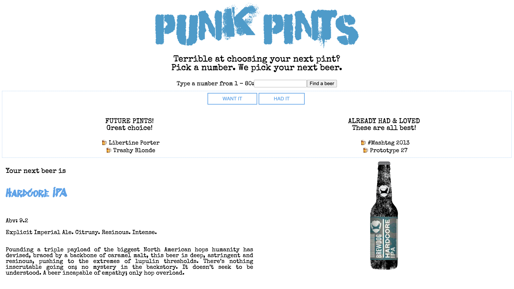

# Punk Pints

</img>

## The Brief

A mini project inspired by the weekend homework from week 7 of the CodeClan professional software development course. I created a fun, interactive app using the Punk API - a searchable, filterable record of Brew Dog's expansive back cataglogue.

Bad at picking your next pint, and always holding up the queue at the bar? Use Punk Pints to choose your next drink!

**Timescale - 2 days**

## How to Use
1. Type a number between 1 and 80
2. Punk Pints will return a beer selected from Punk API
3. If you've already had this beer and enjoyed it, add it to your "had" list
4. If you've not tired this but want too add it to your "want" list to

## Getting Started

### Install dependencies 
`npm i` 

### Run the app 
`npm start`

## Tech Used
- JavaScript
- Express.JS
- React
- Punk API (https://punkapi.com/)

## Changes I'd Like to Make
- Currently the user can add to the lists before a beer has been selected, this adds an empty item to the list. I'd like to stop them from being able to do this.
- Once a beer has been added to the list I would like this beer to not be served to the user again.
- For the app to function well on mobile, seeing as the user will likely be accessing this using their mobile from the pub!
